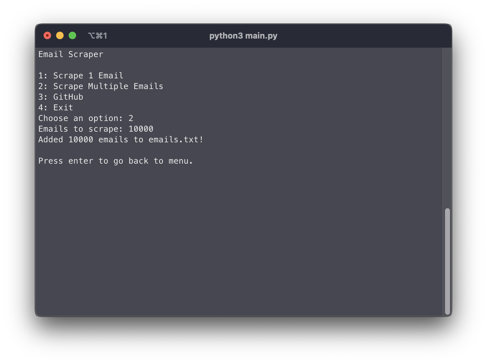

<!-- Header -->
<br/><br/>
<h1 align="center">email-scraper</h1>
  <p align="center">
    Generate thousands of temporary emails within seconds!
    <br />
    <br />
    <a href="https://github.com/SanjaySunil/email-scraper/issues/new?assignees=&labels=Bug&template=bug_report.md&title=%5BBUG%5D">Report Bug</a>
    ·
    <a href="https://github.com/SanjaySunil/email-scraper/issues/new?assignees=&labels=Suggestions&template=suggestions.md&title=%5BSUGGESTION%5D">Request Feature</a>
  </p>
</h1>
<br/><br/>




<!-- Description -->
## What's email-scraper?

[email-scraper]() is a powerful temporary email generator that allows you to scrape thousands of emails Python! Email Scraper uses [fyii.de trashmail provider](https://fyii.de/trashmail/) to generate emails. All emails are unique and have their own inboxes in which emails can be received from. Use email-scraper to use services where you don't want to provide your own email address.
<br />


## Prerequisites

Ensure you have **Python 3** installed. `pip` will also be required to install important packages for the tool.

### Requirements

UUID is the only requirement in this project.

```sh
pip install uuid
```

### Usage

Run `main.py` to start email-scraper menu.


<!-- License -->
## License

Copyright © 2022 Sanjay Sunil (sanjaysunil@protonmail.com)

Distributed under the MIT License. See `LICENSE` for more information.